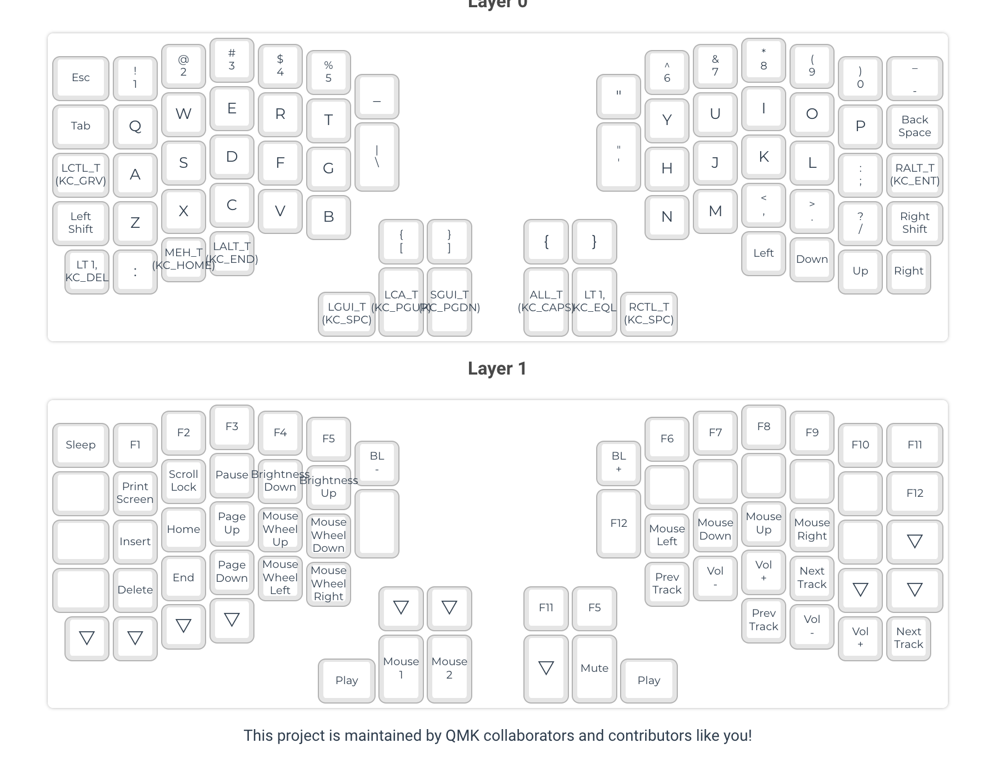

# Redoxpro

> Note, only right hand work for me, so change the `config.h` to right hand mode.





```bash
brew install qmk/qmk/qmk
qmk setup -H ~/inbox/qmk
# <https://config.qmk.fm/#/redox/rev1/LAYOUT>
# download to ~/Downloads/redoxpro.json
cd ~/dotfiles/modules/qmk
./compile_redox_pro.sh ~/Downloads/redoxpro.json
qmk flash
```
